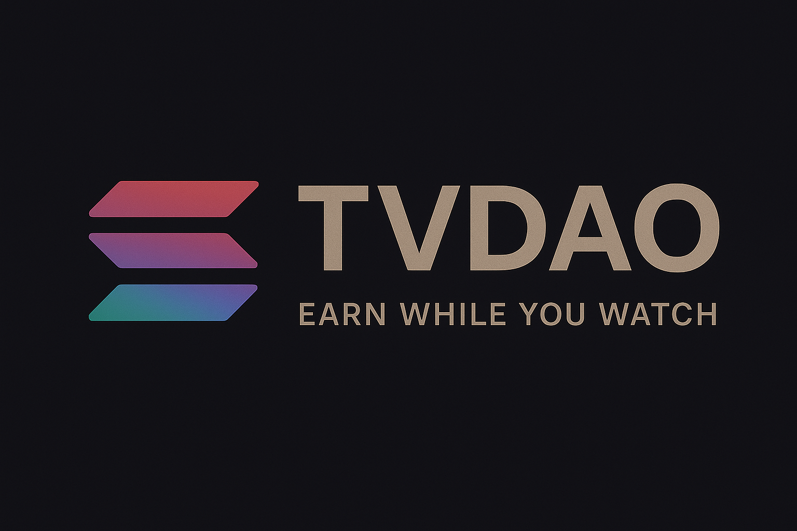

# TV DAO: Decentralized Television Platform



TV DAO is a revolutionary decentralized television platform built on Solana blockchain, redefining content distribution and monetization through smart contracts and community governance.

## Vision

TV DAO envisions a future where content creators have direct control over their distribution and monetization, while viewers actively participate in platform governance. By leveraging blockchain technology, we're creating a transparent, fair, and community-driven ecosystem for video content.

## Key Features

### For Content Creators
- **Decentralized Channel Management**
  - Create and manage channels through Solana smart contracts
  - Set custom pricing tiers (1, 2, or 3 USDC)
  - Direct revenue collection through blockchain
  - Transparent earnings tracking

- **Community-Driven Pricing**
  - Viewers vote on channel pricing tiers
  - 30-minute voting window for price determination
  - Majority-based price finalization
  - Automatic price locking after voting period

- **Revenue Management**
  - Direct earnings claims through smart contracts
  - Transparent payment tracking
  - Automated revenue distribution
  - Real-time earnings dashboard

### For Viewers
- **Interactive Content Discovery**
  - Browse channels by categories
  - Real-time channel status updates
  - Embedded video player integration
  - Personalized content recommendations

- **Community Participation**
  - Vote on channel pricing
  - Track voting history
  - View channel statistics
  - Participate in governance

- **Secure Payments**
  - Solana wallet integration
  - Transparent payment history
  - Instant access to paid content
  - Secure transaction processing

## Technical Architecture

### Smart Contract Layer
- **Program**: `tvdao` (Solana)
- **Key Instructions**:
  - `initializeDaoState`: Sets up DAO governance
  - `submitChannel`: Creates new content channels
  - `votePrice`: Handles viewer price voting
  - `finalizePrice`: Locks in channel pricing
  - `payForChannel`: Processes viewer payments
  - `claimEarnings`: Manages creator revenue

### Frontend Stack
- **Framework**: Next.js 14 with TypeScript
- **Styling**: Tailwind CSS
- **State Management**: React Hooks
- **Blockchain Integration**: 
  - `@solana/web3.js`
  - `@solana/wallet-adapter`
  - `@coral-xyz/anchor`

### Backend Infrastructure
- **API**: Next.js API Routes
- **Database**: MongoDB with Mongoose
- **Authentication**: JWT (future implementation)
- **File Storage**: IPFS (planned)

## Project Structure

```
tv-dao/
├── program/                 # Solana smart contract
│   ├── programs/           # Anchor program code
│   ├── tests/              # Program tests
│   └── scripts/            # Deployment scripts
├── src/
│   ├── app/                # Next.js App Router
│   │   ├── (pages)/        # Route groups
│   │   ├── api/            # Backend API routes
│   │   └── components/     # React components
│   └── lib/                # Shared utilities
└── public/                 # Static assets
```

## Getting Started

### Prerequisites
- Node.js v18+
- Solana CLI tools
- MongoDB instance
- Phantom/Solflare wallet

### Installation

1. **Clone the Repository**
   ```bash
   git clone https://github.com/Samisha68/tvdao.git
   cd tvdao
   ```

2. **Install Dependencies**
   ```bash
   npm install
   ```

3. **Environment Setup**
   Create `.env.local`:
   ```env
   MONGODB_URI=your_mongodb_uri
   JWT_SECRET=your_jwt_secret
   NEXT_PUBLIC_RPC_URL=https://api.devnet.solana.com
   ```

4. **Build Smart Contract**
   ```bash
   cd program
   anchor build
   ```

5. **Start Development Server**
   ```bash
   npm run dev
   ```

## Development

### Available Scripts
- `npm run dev`: Start development server
- `npm run build`: Create production build
- `npm run start`: Run production server
- `npm run lint`: Run linter
- `anchor test`: Run smart contract tests

### Testing
- Frontend: Jest + React Testing Library
- Smart Contract: Anchor test framework
- API: Supertest

## Roadmap

### Phase 1: Core Platform
- [x] Smart contract development
- [x] Basic frontend implementation
- [x] Channel creation and management
- [x] Price voting mechanism

### Phase 2: Enhanced Features
- [ ] Advanced analytics dashboard
- [ ] Creator token implementation
- [ ] Enhanced voting mechanisms
- [ ] Content recommendation system

### Phase 3: Platform Expansion
- [ ] Cross-chain integration
- [ ] NFT marketplace
- [ ] Mobile application
- [ ] Advanced monetization options

## Contributing

We welcome contributions! Please read our [Contributing Guidelines](CONTRIBUTING.md) for details on our code of conduct and the process for submitting pull requests.

## License

This project is licensed under the MIT License - see the [LICENSE](LICENSE) file for details.

## Contact

- **Website**: [tvdao.io](https://tvdao.io)
- **Twitter**: [@tvdao](https://twitter.com/tvdao)
- **Discord**: [Join our community](https://discord.gg/tvdao)

---

Built with ❤️ by the TV DAO team 